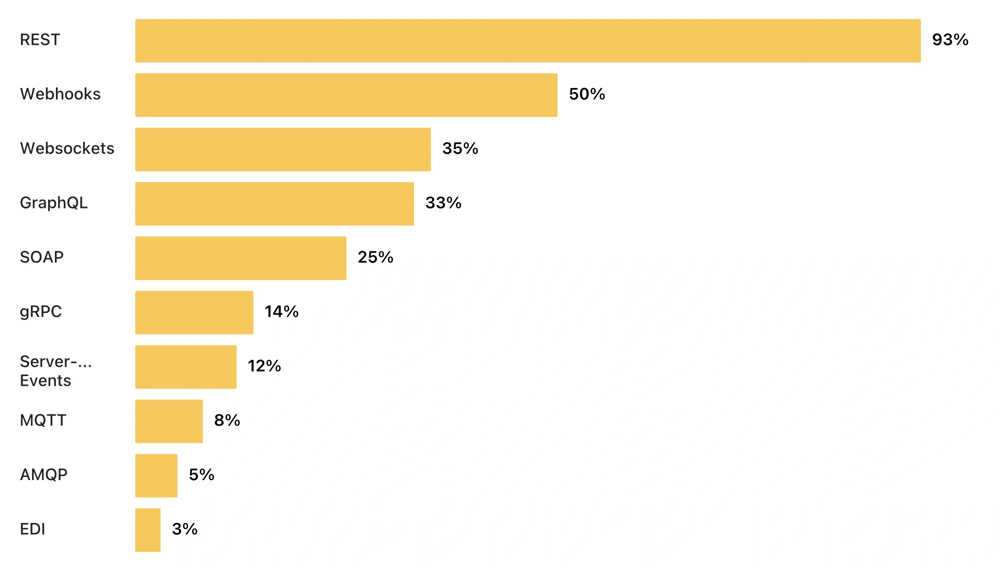
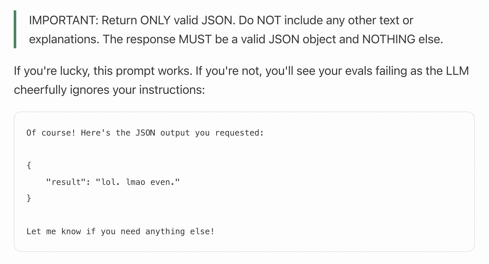
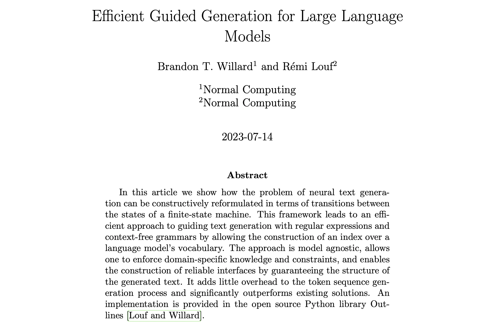

+++
title = "The only schema language AI speaks is JSON Schema"
date = 2026-05-01
author = "jviotti"
+++

> TL;DR: Every major LLM provider (OpenAI, Google, Anthropic, Mistral, xAI,
> DeepSeek), the Model Context Protocol, and the AI products built on them
> (agent frameworks and vertical AI APIs) have all converged on the same and
> only schema language: JSON Schema.

## AI is plumbed into APIs, and APIs speak JSON

AI is delivered through APIs. Every major LLM provider exposes its models
behind an HTTP endpoint. AI also consumes the world through APIs: tool calls
hit REST endpoints and [MCP servers](https://www.pulsemcp.com/servers) expose
capabilities over HTTP. APIs sit on both sides of the boundary.

That observation is not contested. [Marco
Palladino](https://konghq.com/blog/enterprise/what-is-an-ai-gateway), CTO of
Kong, writes: *AI traffic is API traffic*. [Postman's 2024 State of the API
report](https://www.postman.com/state-of-api/2024) recorded a 73%
year-over-year jump in AI-related API traffic across its platform, with OpenAI
alone accounting for 78.5% of it. The [2025
follow-up](https://www.postman.com/state-of-api/2025/) puts it even more
directly: *APIs are no longer just powering applications. They're powering
agents.* [Kin
Lane](https://apievangelist.com/2025/01/27/how-do-i-prepare-my-apis-for-ai-agents/)
treats AI agents as just another API consumer.

And those APIs speak JSON. In [Postman's 2025 State of the API
survey](https://www.postman.com/state-of-api/2025/) of 5,700+ developers, 93%
reported building REST APIs, and REST APIs in practice mean JSON over HTTP.

JSON is what application-layer software uses to move structured data between
processes, services, and organisations. The format question was settled before
LLMs arrived.

## From "please respond in valid JSON, I'm begging you" to schema-enforced generation

If AI is delivered through APIs and APIs speak JSON, then naturally users
wanted LLMs to talk JSON too. In 2023, getting it reliably was a notorious
engineering pain. Workarounds piled up: regex extractors, assistant prefills
(`"Here is your JSON output: {"`), multi-step prompting, repair loops, and even
prompts that politely *begged* the model to comply. Each had its own brittle
edge cases. Charlie Guo's [*Stop begging for
JSON*](https://www.ignorance.ai/p/stop-begging-for-json) is the museum tour,
and captures perfectly what anyone shipping LLM features had lived through:

The community treated the problem as serious enough to need dedicated
infrastructure. [jsonformer](https://github.com/1rgs/jsonformer) (~5000 stars
on GitHub), an open-source library released in early 2023, opened its README by
saying *current approaches to this problem are brittle and error-prone*. The
OpenAI developer forums in 2023–2024 were full of [similar
threads](https://community.openai.com/t/gpt3-5-json-output-format/712044).

To solve this, OpenAI famously shipped the [Structured
Outputs](https://openai.com/index/introducing-structured-outputs-in-the-api/)
feature in August 2024: hand the API a [JSON Schema](https://json-schema.org), and the model's output is
guaranteed to validate against it at the token level. No more begging, no more
retry loops, no more regex extractors. The pain went from a weekly source of
suffering to an API parameter.

The choice of JSON Schema specifically wasn't accidental. JSON Schema had been
the de facto schema language for HTTP APIs for years.
[OpenAPI](https://www.openapis.org), the dominant API description standard, is
built on top of it. AI runs on APIs. When OpenAI needed a contract language for
the JSON-output problem, they naturally reached for the one API engineers
already used.

## Structured outputs: six providers, one schema language

Structured outputs proved indispensable beyond chat UIs, for any production
pipeline that needed to consume LLM output programmatically. As [Julien
Chaumond](https://dottxt.ai), CTO of HuggingFace, put it: *Structured
generation is the future of LLMs.* Within fifteen months of the first such
launch, every major LLM provider had shipped equivalent support. At the time of
this writing, all of them support JSON Schema. Literally all of them:

| Provider | Launched | Dialect support | Notes |
|---|---|---|---|
| [OpenAI](https://platform.openai.com/docs/guides/structured-outputs) | August 2024 | Unspecified | `response_format` with `json_schema` |
| [xAI / Grok](https://docs.x.ai/docs/guides/structured-outputs) | December 2024 | [2020-12](https://www.learnjsonschema.com/2020-12/) and [Draft 7](https://www.learnjsonschema.com/draft7) | `response_format` with `json_schema` |
| [Mistral](https://docs.mistral.ai/capabilities/structured_output/) | January 2025 | Unspecified | `response_format` with `json_schema` |
| [DeepSeek](https://api-docs.deepseek.com/guides/function_calling) | August 2025 (Beta) | Unspecified | Through strict-mode function calling |
| [Google Gemini](https://blog.google/technology/developers/gemini-api-structured-outputs/) | November 2025 | Unspecified (OpenAPI 3.0 lineage) | `response_json_schema` parameter |
| [Anthropic](https://platform.claude.com/docs/en/build-with-claude/structured-outputs) | November 2025 | [2020-12](https://www.learnjsonschema.com/2020-12/) | `output_config.format` (and strict tool use) |

> As an interesting data point: every provider supports JSON Schema and only
> JSON Schema on the wire. Not Protocol Buffers. Not Apache Avro. Not GraphQL
> SDL. Not even Google, despite [having invented Protocol
> Buffers](https://protobuf.dev/), supports it in their own AI API.

But while every model now technically accepts JSON Schema, it's not all rosy
yet. Dialect commitment is uneven, with only xAI explicitly naming the ones
they support. As [Ben
Hutton](https://words.benhutton.me/2025-01-20-openai-chatgpt-and-structured-output-with-json-schema-pt1),
a JSON Schema Technical Steering Committee member, writes: *You wouldn't push
your code to a server where you didn't know what version of the programming
language is installed. So why is this OK for JSON Schema?*

And even where the dialect is named, each provider supports a different slice
of the language: there are keyword gaps, varied nested-schema depth limits, and
different limitations on advanced features. Even worse, the providers diverge
on which features they support. For example, OpenAI supports recursive schemas
but rejects [`allOf`](https://www.learnjsonschema.com/2020-12/applicator/allof/),
while Anthropic does the opposite.

The meme has evolved. Yesterday's pain was begging for valid JSON responses.
Today, we beg that a valid JSON Schema is actually accepted by every provider.

## LLM output constraining is hard

This isn't JSON Schema's fault. Constraining an LLM's output to a schema at the
token level is a genuinely hard problem. Each token the model emits has to keep
the output valid, and supporting more of JSON Schema's advanced features
(logical operators, dynamic referencing and polymorphism, highly circular
schemas, and more) makes it even harder.

And this problem is complex and important enough that an entire research
subfield, [constrained decoding](https://arxiv.org/abs/2307.09702), has formed
around it.  Open-source libraries like
[Outlines](https://github.com/dottxt-ai/outlines) (65M+ downloads),
[XGrammar](https://github.com/mlc-ai/xgrammar), and Microsoft's
[llguidance](https://github.com/guidance-ai/llguidance) made the technique
practical at production scale. There is even a published academic benchmark,
[JSONSchemaBench](https://arxiv.org/pdf/2501.10868), built on 10,000 real-world
JSON Schemas to evaluate competing implementations.

Even more, the authors of that paper went on to found
[dottxt](https://dottxt.ai), a French startup that [raised
$11.9M](https://techfundingnews.com/french-startup-dottxt-raises-11-9m-to-tell-how-ai-models-answer/)
to solve this specific problem. Born from their popular
[Outlines](https://github.com/dottxt-ai/outlines) library, dottxt aims for
full LLM JSON Schema coverage and already supports far more of JSON Schema
than the major providers do, allowing users to make use of JSON Schema on
arbitrary models without feeling the compatibility pain.

## Tool calling, and how MCP unified it

LLMs are most powerful when they can connect to other systems: query databases,
hit APIs, run computations, fetch documents. To do this they need a way to
declare *I want to call this function with these arguments*, and every major
provider had to ship one. Unsurprisingly, they all landed on the same answer:
define the tool's input as JSON Schema. OpenAI's
[`parameters`](https://platform.openai.com/docs/guides/function-calling),
Anthropic's
[`input_schema`](https://platform.claude.com/docs/en/agents-and-tools/tool-use/define-tools),
Gemini's
[`function_declarations`](https://ai.google.dev/gemini-api/docs/function-calling).
Different field names, identical substrate.

Then [MCP](https://modelcontextprotocol.io) (Model Context Protocol) came along
to unify it. [Announced by
Anthropic](https://www.anthropic.com/news/model-context-protocol) in November
2024 and [built on JSON Schema
2020-12](https://modelcontextprotocol.io/specification/2025-11-25), MCP is to
AI agents what OpenAPI is to HTTP APIs: a single shared way to describe tools
so any model can discover and invoke them. [OpenAI's official adoption in March
2025](https://techcrunch.com/2025/03/26/openai-adopts-rival-anthropics-standard-for-connecting-ai-models-to-data/)
was the inflection point. Monthly SDK downloads jumped from around 8 million to
22 million within weeks. Google DeepMind, Microsoft, Meta, Cursor, Windsurf,
JetBrains, Replit, and ChatGPT desktop followed. In December 2025, Anthropic
donated MCP to the [Linux Foundation](https://www.linuxfoundation.org), the
same body that governs [OpenAPI](https://www.openapis.org) and
[AsyncAPI](https://www.asyncapi.com).

](mcp-timeline.webp)

The adoption is substantial. By March 2026, MCP SDKs had reached [97
million monthly
downloads](https://effloow.com/articles/mcp-ecosystem-growth-100-million-installs-2026),
with [13,700+ servers on PulseMCP
alone](https://www.pulsemcp.com/servers) and 300+ MCP clients across
editors, chat apps, and enterprise platforms. The business case is
concrete. [Block](https://block.xyz/) reports 50–75% time savings on common
tasks for thousands of employees using their MCP-compatible
[Goose](https://block.github.io/goose/) agent. [Microsoft's Sales Development
Agent](https://www.microsoft.com/en-us/dynamics-365/blog/business-leader/2025/11/18/microsoft-ignite-2025-powering-frontier-firms-with-agentic-business-applications/)
recorded a 15.1% increase in lead-to-opportunity conversion across
61,734 leads. [Zapier's MCP server](https://zapier.com/mcp) connects
9,000+ apps with 30,000+ actions.

The entire LLM tool ecosystem now builds on JSON Schema too.

## And the whole AI stack speaks JSON Schema

Beyond the LLM APIs and the MCP/tools layer, the JSON Schema foundation
extended naturally upward to the AI products built on top. Here is a
non-exhaustive list:

- **[Retab](https://www.retab.com)**. Document AI platform with
  [$3.5M pre-seed](https://www.startuphub.ai/ai-news/funding-round/2025/retab-exits-stealth-mode-with-3-5m-for-sota-ai-document-processing/)
  backed by Eric Schmidt and the CEOs of Datadog and Dataiku, with
  500M+ documents processed. Their SDK literally takes a `json_schema`
  argument
- **[LandingAI](https://landing.ai)**. Andrew Ng's document AI
  company. Their Agentic Document Extraction takes [JSON Schema as
  its extraction
  format](https://docs.landing.ai/ade/ade-extract-schema-json), with
  documented support for standard JSON Schema keywords and format
  values
- **[Vapi](https://vapi.ai)**. Voice AI agent platform. Custom tool
  definitions take a JSON Schema as the `parameters` field
- **[AssemblyAI](https://www.assemblyai.com)**. Speech and transcript
  understanding. Their LLM Gateway exposes `response_format` with
  `json_schema`, OpenAI-compatible
- **[Firecrawl](https://www.firecrawl.dev)**. Web scraping and
  extraction. The `schema` parameter takes a JSON Schema describing
  the structured output to extract from a page
- **[Tavily](https://tavily.com)**. Deep research API. The
  `output_schema` parameter is *"a JSON Schema object that defines
  the structure of the research output"*

Above the products sit *agent frameworks*: the libraries and tools developers
use to build programs that compose LLMs with tools, memory, and control flow to
decide for themselves which actions to take. Unsurprisingly, every major one
uses JSON Schema as the contract between the model and the tools it can invoke:

- **[LangChain](https://www.langchain.com)**. The dominant Python agent
  framework
- **[CrewAI](https://www.crewai.com)**. Multi-agent orchestration
- **[OpenAI Agents SDK](https://openai.github.io/openai-agents-python/)**.
  OpenAI's first-party agent framework
- **[Microsoft Semantic
  Kernel](https://learn.microsoft.com/semantic-kernel/)**.  Microsoft's
  framework supporting .NET, Python, and Java
- **[Mastra](https://mastra.ai)**. TypeScript-first agent framework
- **[Vercel AI SDK](https://ai-sdk.dev)**. The dominant Next.js AI integration
  layer
- **[Composio](https://composio.dev)**. Tool-integration platform with hundreds
  of pre-built integrations

None of these products coordinate on which schema language to use. They
independently arrived at the same answer to the same problem, making JSON
Schema the contract at every layer of the stack.

## Even the exception isn't quite an exception: the A2A hybrid case

You would expect at least one exception to this convergence. Google has every
reason to push [Protocol Buffers](https://protobuf.dev/) in their AI
infrastructure. So when Google designed [A2A](https://a2a-protocol.org/)
(Agent-to-Agent), an open protocol for AI agent-to-agent communication, they
made Protocol Buffers the *"single authoritative normative definition"* of the
spec.

End of story? Not quite. Look at how A2A actually works on the wire and JSON
Schema is still everywhere. Agents communicate using [JSON-RPC
2.0](https://www.jsonrpc.org/specification) over HTTP. The wire format is JSON,
not binary Protocol Buffers. The spec already [generates a JSON Schema at
build time](https://github.com/a2aproject/A2A/blob/v1.0.0/scripts/proto_to_json_schema.sh)
out of the Protocol Buffers definition, and the authors plan to add an
OpenAPI v3 bundle on top for enhanced tooling. You can explore these schemas at
[schemas.sourcemeta.com](https://schemas.sourcemeta.com/a2a).

](a2a-schemas.webp)

So even where Protocol Buffers wins as the authoring source, JSON Schema wins
as the interoperability substrate. [Charlie
Holland](https://www.chiply.dev/post-schema-languages) captures the pattern
precisely: *"JSON Schema becomes the 'assembly language' of schema
definitions"* and higher-level languages compile down.

The exception confirms the rule: convergence on JSON Schema is not just visible
at the LLM layer. It reaches even into the protocols designed to avoid it.

## The schema layer deserves its own infrastructure

JSON Schema was first proposed in 2007 as a way to annotate JSON documents.
Nobody designed it for AI. It quietly became the [dominant API-spec
substrate]() over a decade and
a half. The AI industry did not pick JSON Schema. It found that JSON Schema had
already been picked, by seventeen years of accumulated convention, and built on
top. As [Charlie Holland](https://www.chiply.dev/post-schema-languages) frames
it, JSON Schema has become *the interface definition language for AI tools*.

The implication for anyone building APIs or AI-facing software is direct. Your
schema layer is no longer documentation. It is the interface AI systems will
use to consume your software. Schema quality, governance, and infrastructure
were not your top priority five years ago. They will be in five more.
